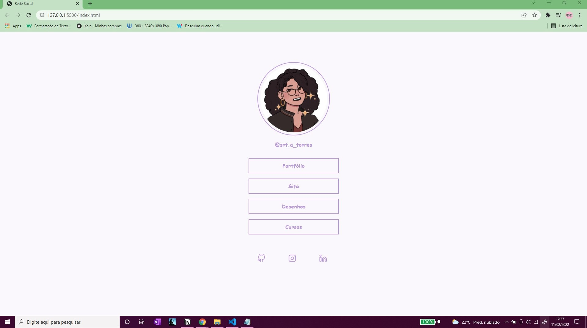
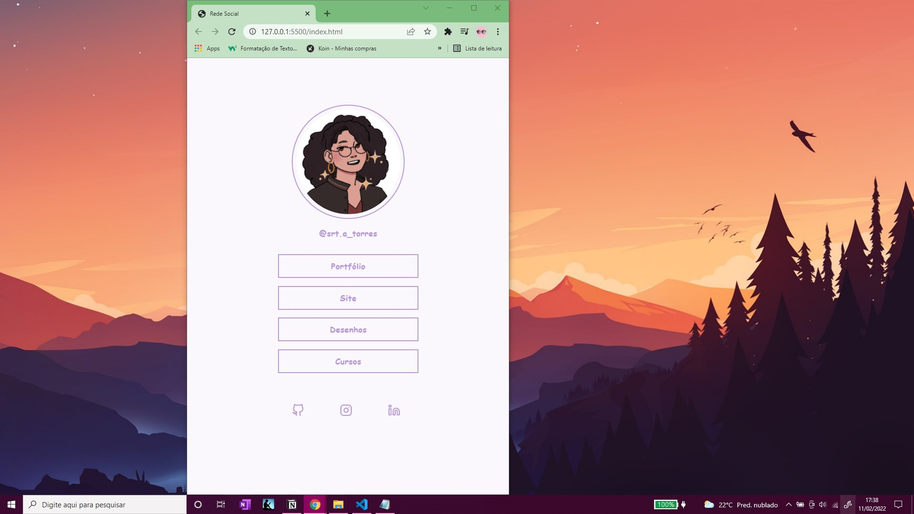
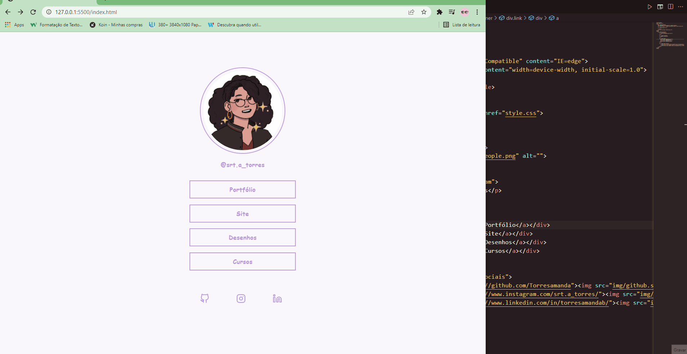

# Árvore de Redes Sociais

    Nesse projeto coloquei os meus conhecimentos de HTML & CSS para cumprir o desafio da <a href="https://www.rocketseat.com.br/">rocketseat</a> a plataforma deles tem vários desafios que pretendo cumprir, de longe foi umas das melhores plataformas de programação que já encontrei. 

    Esse projeto é simples e não tem nada demais, mas ele mostra a minha evolução até agora e quanto eu avançei nos meus estudos em HTML & CSS, fiz ele com as recomedações da rocketseat e adicionei algumas modificações simples, mas tentei manter o projeto fiel ao modelo deles. 

    A idéia é que eu consegui-se replicá-lo o mais fiel possível e eu consegui, eu tive que consultar a documentação algumas vezes, mas fora isso não tive dificuldades. 

    

 

    

 

    

##

## Linguagens Utilizadas

    
    
 

